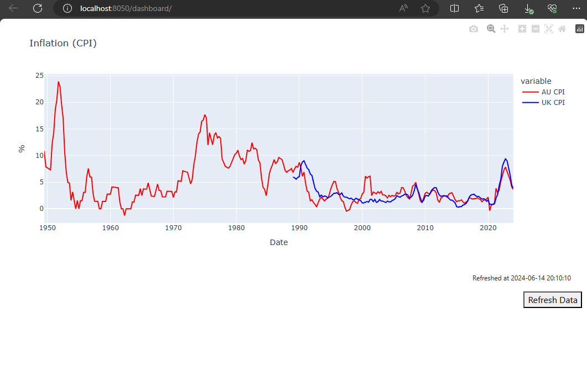

# Inflation Dashboard
## Requirements Engineering
### Feature: Data Retrieval and Formatting
```
Feature: Data Retrieval and Formatting
  
  Scenario: Retrieve and format UK inflation data
    Given I have the UK CPIH API endpoint
    When I request data in CSV format
    Then I should receive the UK inflation index data in CSV format
    And I should parse the CSV data correctly

  Scenario: Retrieve and format AU inflation data
    Given I have the AU CPI API endpoint
    When I request data in CSV format
    Then I should receive the AU inflation index data in CSV format
    And I should parse the CSV data correctly

```

### Feature: Annualised Inflation Calculation
```
Feature: Annualised Inflation Calculation
  
  Scenario: Calculate annualised inflation rate for UK
    Given I have UK inflation index data for two consecutive years
    When I apply the inflation rate formula
    Then I should get the correct annualised inflation rate for the UK

  Scenario: Calculate annualised inflation rate for AU
    Given I have AU inflation index data for two consecutive years
    When I apply the inflation rate formula
    Then I should get the correct annualised inflation rate for the AU

```

### Feature: Visualization
```
Feature: Visualization
  
  Scenario: Plot UK and AU inflation rates on a line graph
    Given I have annualised inflation rate data for the UK and AU
    When I create a line graph using Dash
    Then the graph should display both UK and AU inflation rates as percentages over time
    And the graph should be clear and easy to understand

```

### Feature: Deployment and Testing
```
Feature: Deployment and Testing

  Scenario: Prepare the Dash app for deployment
    Given I have developed the Dash app
    When I package the app using Poetry
    Then all dependencies should be managed in pyproject.toml
    And the package should be built and ready for distribution as a Docker container

  Scenario: Test the Dash app
    Given I have the Dash app code
    When I write unit tests for data retrieval, calculation, and plotting
    Then all tests should pass successfully
    And the app should demonstrate robustness and reliability
```

## Build Instructions
### Distribution
The project uses Poetry to manage dependencies, build, and distribution. It is deployed as a Docker container.

- **Testing**: Pytest is utilized for unit tests. Additional effort is needed for integration and UI testing.
```bash
poetry run pytest
```

- **Poetry Build and Publish**: Execute the following commands to build and publish the project. Extra setup is required to publish to a repository like PyPI.
```bash
poetry install
poetry build
poetry publish
```

####  Deploying on Docker
The solution can be deployed using Docker.

- **Start Docker Containers**: Run the following commands to start the Docker containers.

```bash
docker-compose down
docker-compose up --build
```

## Dashboard and API Endpoints
- **Dashboard**: Access the dashboard at [http://localhost:8050/dashboard/](http://localhost:8050/dashboard/).

- **Health Endpoint**: Check the health of the application at [http://localhost:8050/api/health](http://localhost:8050/api/health).
- **Data Endpoints**: Retrieve CPI data for Australia and the UK using the following endpoints:
  - **Australia**: [http://localhost:8050/api/cpi/au](http://localhost:8050/api/cpi/au)
  - **UK**: [http://localhost:8050/api/cpi/uk](http://localhost:8050/api/cpi/uk)
- **Analytics Endpoints**: Access annualized CPI data for Australia and the UK through these endpoints:
  - **Australia**:[http://localhost:8050/api/annualised_cpi/au](http://localhost:8050/api/annualised_cpi/au)
  - **UK**: [http://localhost:8050/api/annualised_cpi/uk](http://localhost:8050/api/annualised_cpi/uk)
