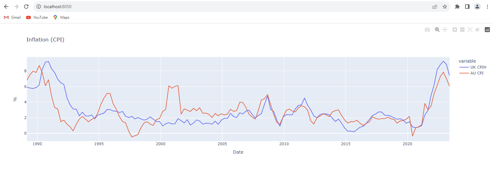

# Inflation Dashboard
We would like a very simple python Dash app that plots UK and Australian annualised inflation rates. The python code should:
1) Download data from the sources outlined below
2) Format the data
3) Plot the required chart in a dash app

**Please do not distribute your solution publicly. Please send your source code directory structure in a 
zip / gzipped-tarball**. Rename the file extension “.txt” if you have difficulties with email filters.

## DESIRED OUTPUT
Your dash app should as a minimum produce a line graph similar to the one below, plotting both UK and AU inflation 
time series on the same chart as a percentage



## DATA AVAILABILITY
UK and Australian Inflation indices are freely available. The REST API details are below.

### UK CPIH:
The UK inflation index can be sourced using the details below. The response will contain CSV data.

`GET URL`: [https://www.ons.gov.uk/generator](https://www.ons.gov.uk/generator)

`QUERY PARAMETERS:`
```sh
uri: /economy/inflationandpriceindices/timeseries/l522/mm23
format: csv
```

`EXAMPLE:`
```sh
curl "https://www.ons.gov.uk/generator?format=csv&uri=/economy/inflationandpriceindices/timeseries/l522/mm23"
```

### AU CPI:
`GET URL`: https://api.data.abs.gov.au/data/CPI/1.10001.10.50.Q](https://api.data.abs.gov.au/data/CPI/1.10001.10.50.Q)

`QUERY PARAMETERS:`
```sh
format: csv
```

`EXAMPLE:`
```sh
curl https://api.data.abs.gov.au/data/CPI/1.10001.10.50.Q?format=csv
```

## INFLATION CALCULATION
The APIs will index data. This should be converted to an inflation rate. 
For example, if the Australian Index has the following values:

2022-Q2: 126.1

2023-Q2: 133.7

The annualised inflation rate for 2023-Q2 is (133.7 – 126.1) / 126.1 == 0.0602

## EXTRA CREDIT
Imagine this code will be deployed into a production environment. Extra credit will be given if your solution demonstrates the following:
- How will it be distributed (pip package?)
- How will you test it?
- What are your external dependencies?

Extra consideration should be given to the formulation of a robust design.